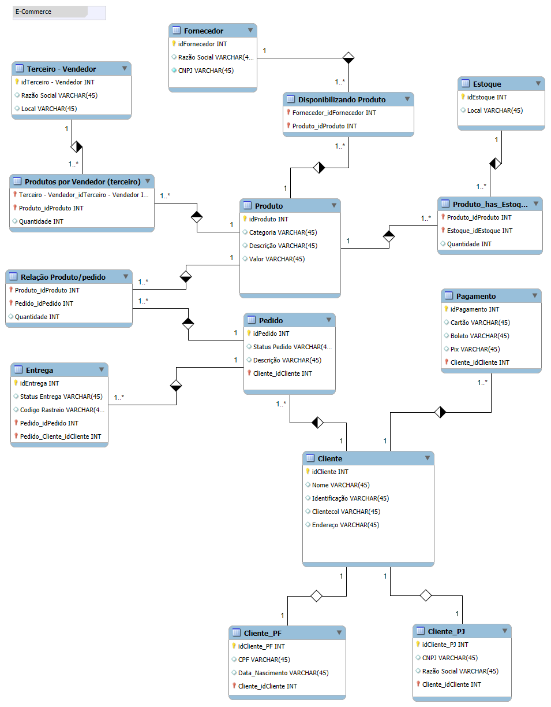

# Refinando um Projeto Conceitual de Banco de Dados - E-Commerce

📊 Descrição do Desafio:

O esquema deverá ser adicionado a um repositório do Github para futura avaliação do desafio de projeto. 
Adicione ao Readme a descrição do projeto conceitual para fornecer o contexto sobre seu esquema.

## Introdução

Este projeto representa a modelagem conceitual de um banco de dados para um sistema de E-Commerce, 
desenvolvido com o objetivo de simular e organizar as principais entidades e processos envolvidos em 
uma operação de comércio eletrônico.
A modelagem foi construída utilizando o **MySQL Workbench**, com foco na normalização e clareza dos 
relacionamentos entre entidades, respeitando as seguintes regras de negócio:

## Regras de Negócios

- Um cliente pode ser pessoa física (PF) ou pessoa jurídica (PJ), **mas não pode ser os dois simultaneamente**.
- Um cliente pode cadastrar **mais de uma forma de pagamento**, permitindo flexibilidade na escolha ao finalizar um pedido.
- Cada pedido possui uma **entrega associada com status e código de rastreamento**.
- Um produto pode estar armazenado em **diferentes locais de estoque**, com controle de quantidade por unidade armazenada.
- Os produtos podem ser disponibilizados tanto por fornecedores diretos quanto por vendedores terceiros.

## Objetivo

Refine o modelo apresentado acrescentando os seguintes pontos:

- Cliente PJ e PF – Uma conta pode ser PJ ou PF, mas não pode ter as duas informações;
- Pagamento – Pode ter cadastrado mais de uma forma de pagamento;
- Entrega – Possui status e código de rastreio;

##  Diagrama

